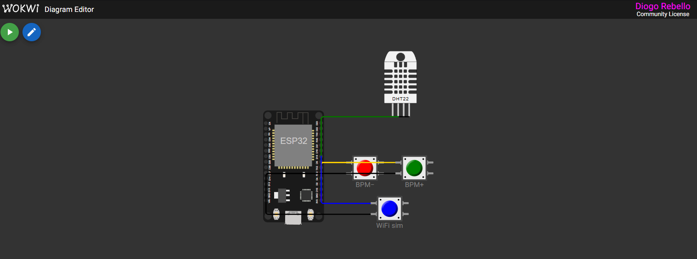
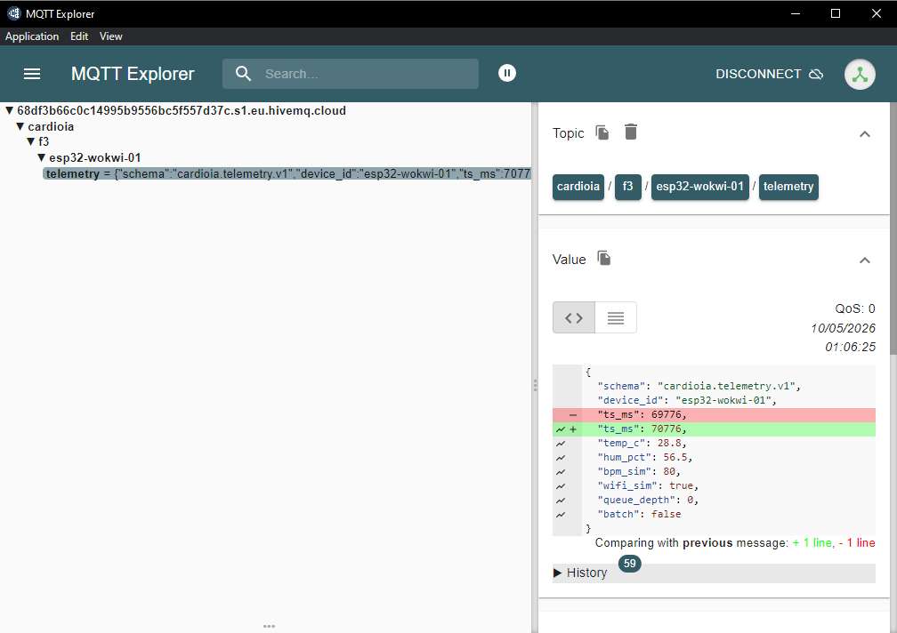
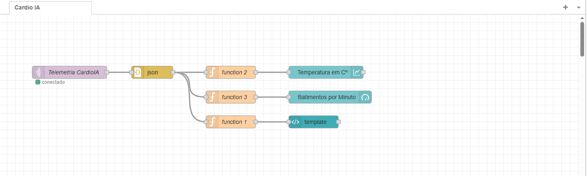
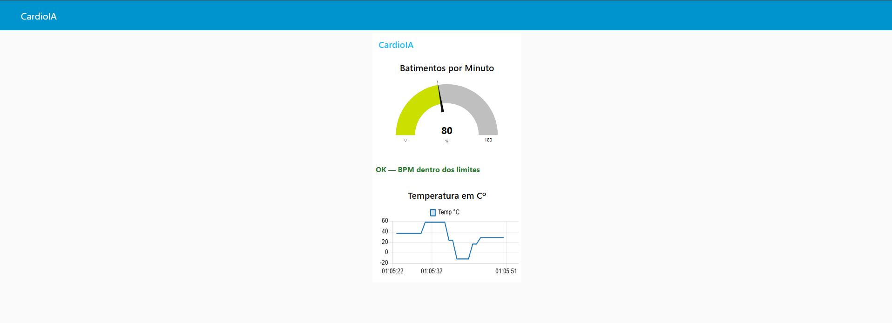
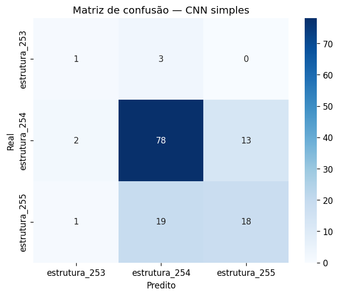
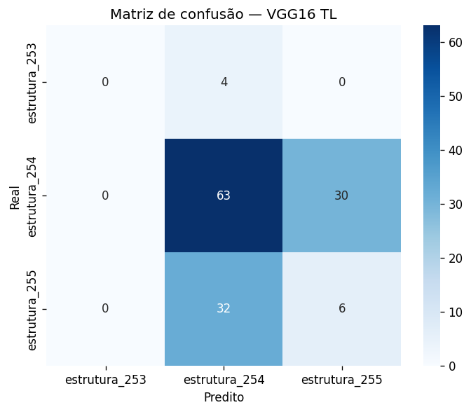
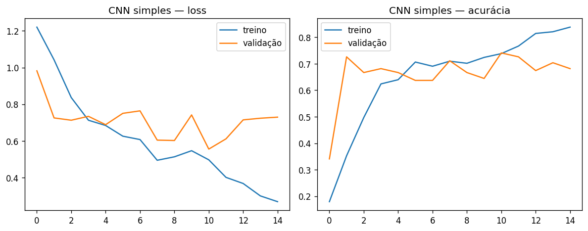
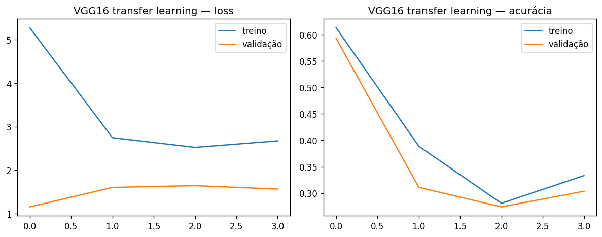

# FIAP - Faculdade de Informática e Administração Paulista

<p align="center">
<a href= "https://www.fiap.com.br/"></a>
</p>

<br>

# CardioIA

## Grupo

## 👨‍🎓 Integrantes: 
- <a href="#">Diogo Rebello</a>
- <a href="#">Vera Chaves</a>

## 👩‍🏫 Professores:
### Tutor(a) 
- <a href="#">Caique Nonato da Silva Bezerra</a>
### Coordenador(a)
- <a href="#">André Godoi Chiovato</a>

## 🗺 Mapa das fases (navegação)

| Fase | Título | Status | Seção no README |
|------|--------|--------|-----------------|
| 1 | Batimentos de Dados | Concluída | [FASE 1](#fase-1--batimentos-de-dados) |
| 2 | Estetoscópio Digital | Concluída | [FASE 2](#fase-2--estetoscópio-digital) |
| 3 | IoT, Edge, MQTT e Node-RED | Concluída | [FASE 3](#fase-3--iot-edge-mqtt-e-node-red) |
| 4 | Assistente Cardiológico Virtual (Visão) | Concluída | [FASE 4](#fase-4--assistente-cardiológico-virtual-visão-computacional) |

Checklist detalhado da Fase 4: [docs/fase4-plano-checklist.md](docs/fase4-plano-checklist.md).

---

## 📁 Estrutura de pastas

```
cap1-a-busca-de-dados-inteligencia-cardiologica/
├── README.md
├── .gitattributes
├── .gitignore
├── datasets/
│   ├── dataset_cardiologia.csv      # Fase 1 (Cleveland); reutilizado na Fase 2 alinhado às frases
│   ├── frases_risco.csv             # Fase 2 — frases rotuladas (alto/baixo risco)
│   ├── mapa_conhecimento.csv        # Fase 2 — pares de sintomas → doença (regras)
│   └── sintomas_pacientes.txt       # Fase 2 — relatos fictícios (uma frase por linha)
├── notebooks/
│   ├── fase2_cardioia_estetoscopio_digital.ipynb   # Fase 2
│   ├── fase4_parte1_preprocessamento.ipynb         # Fase 4 — pré-processamento (Colab)
│   └── fase4_parte2_cnn_classificacao.ipynb        # Fase 4 — CNN + transfer learning (Colab)
├── esp32/                           # Fase 3 — firmware Wokwi / PlatformIO, diagram.json, MQTT
├── app/                             # Fase 4 — protótipo Flask (opcional)
├── docs/                            # Relatórios por fase (PDF/MD)
├── dashboard/                       # Fase 3 — export de referência Node-RED (JSON)
└── assets/
    ├── logo-fiap.png
    ├── fase3/                       # Fase 3 — evidências (prints Wokwi, MQTT, Node-RED)
    ├── fase4/                       # Fase 4 — prints de métricas (matriz de confusão, curvas)
    └── docs/
        ├── a_promocao_da_saude_e_a_prevencao_integrada_dos_fatores_de_risco_para_doencas_cardiovasculares.txt
        └── fatores_associados_as_doencas_cardiovasculares_na_populacao_adulta_brasileira_pesquisa_nacional_de_saude.txt
```

| Pasta / arquivo | Descrição |
|-----------------|-----------|
| **README.md** | Guia geral do repositório e das fases. |
| **datasets/** | Bases em CSV e TXT: Cleveland (Fase 1), mapa de sintomas, relatos e frases de risco (Fase 2). O XLSX do Cleveland, quando usado, segue o link da Parte 1 (Google Drive). |
| **notebooks/** | **Fase 2:** estetoscópio digital (regras + TF-IDF). **Fase 4:** pré-processamento e CNN/transfer learning (Colab). |
| **esp32/** | **Fase 3:** firmware ESP32 (`src/main.cpp`), `diagram.json` (Wokwi), `platformio.ini`, `secrets.h.example` — **não** commitar `secrets.h`. |
| **app/** | **Fase 4:** protótipo web Flask (`app.py`, `templates/`) — opcional se o grupo usar notebook interativo. |
| **docs/** | Relatórios por fase: Fase 3 (`relatorio_fase3_parte*.pdf`); Fase 4 [`relatorio_fase4_parte1.md`](docs/relatorio_fase4_parte1.md), [`relatorio_fase4_parte2.md`](docs/relatorio_fase4_parte2.md); checklist [fase4-plano-checklist.md](docs/fase4-plano-checklist.md). |
| **dashboard/** | **Fase 3:** `dashboard-node-red.json` (fluxo de referência; credenciais devem ser reconfiguradas após import). |
| **assets/fase3/** | **Fase 3:** imagens de evidência (simulador, MQTT Explorer, Node-RED). |
| **assets/fase4/** | **Fase 4:** prints de métricas (matriz de confusão, curvas de treino, comparação CNN vs transfer learning). |
| **assets/** | Logos e materiais de apoio ao README. |
| **assets/docs/** | Textos em português para NLP na Fase 1 (DCV, prevenção, fatores de risco). |

---

# FASE 1 — Batimentos de Dados

## 📜 Descrição

Este repositório corresponde à **Fase 1 – Batimentos de Dados** do projeto **CardioIA**: a base de dados que alimentará os módulos inteligentes da plataforma ao longo das 7 fases do curso. Aqui atuamos como cientistas de dados hospitalares, levantando, organizando e documentando três tipos de dados cardiológicos:

- **Dados numéricos (Parte 1):** dataset de pacientes com variáveis clínicas (idade, sexo, pressão arterial, colesterol, sintomas, frequência cardíaca e diagnóstico), em CSV e XLSX, com links no Google Drive.
- **Dados textuais (Parte 2):** textos em português sobre doenças cardiovasculares, prevenção e fatores de risco, na pasta `assets/docs/`, para uso em NLP nas fases seguintes.
- **Dados visuais (Parte 3):** imagens de ecocardiograma (dataset CAMUS), com link no Google Drive e justificativa de uso em visão computacional.

O foco é a **relevância clínica** das informações e a **governança de dados** em IA, preparando a base para triagem, diagnósticos assistidos, monitoramento e soluções inovadoras no ecossistema de cardiologia inteligente do CardioIA.


## 📜 Parte 1 – Dados Numéricos (IoT)

O dataset de pacientes cardiológicos está organizado neste repositório na pasta **`datasets/`** e também disponível em nuvem para acesso e correção:

- **CSV:** [Google Drive – dataset em CSV](https://drive.google.com/file/d/15dhiXDzmEJjdpJG1xdCrk7TOjHyNuDax/view?usp=sharing)
- **XLSX:** [Google Drive – dataset em XLSX](https://docs.google.com/spreadsheets/d/1fZkHUJpJik-BF6JHHbcRObQJmbDb8T1n/edit?usp=sharing&ouid=104955316596639670804&rtpof=true&sd=true)

### Origem dos dados

Os dados são **reais e anonimizados**, provenientes do **UCI Machine Learning Repository** – base **Heart Disease (Cleveland)**. Identificadores e números de segurança social foram substituídos por valores dummy, conforme documentação do repositório. O arquivo utilizado é o *processed Cleveland*, com 303 registros e 14 atributos utilizados em experimentos de ML.

### Variáveis mais relevantes do ponto de vista clínico e importância para IA em saúde

| Variável | Relevância clínica | Justificativa para IA em saúde |
|----------|--------------------|--------------------------------|
| **idade** | Fator de risco clássico para doença cardiovascular. | Modelos de risco e triagem dependem da faixa etária para calibração e prevenção. |
| **sexo** | Diferenças de prevalência e manifestação entre sexos (ex.: sintomas em mulheres). | Permite avaliar e mitigar viés do modelo e personalizar alertas. |
| **pressão arterial** | Hipertensão é um dos principais fatores de risco modificáveis. | Entrada fundamental em scores de risco e sistemas de triagem digital. |
| **colesterol** | Dislipidemia associada a eventos cardiovasculares. | Usada em modelos preditivos e recomendações de estilo de vida. |
| **sintomas (tipo de dor no peito)** | Sintoma cardinal para suspeita de doença coronariana. | Base para classificação automática e priorização na triagem. |
| **frequência cardíaca máxima** | Reflete capacidade funcional e resposta ao esforço. | Indicador de isquemia e capacidade de exercício em modelos de prognóstico. |
| **histórico/resultado (diagnóstico)** | Desfecho clínico (angiografia): ausência ou gravidade da doença. | Variável alvo para classificação binária ou multiclasse em modelos de ML. |

### Legenda dos códigos (enumeradores)

As colunas categóricas do dataset usam códigos numéricos. Significado conforme documentação do UCI Heart Disease:

**sexo**

| Valor | Significado |
|-------|-------------|
| 0 | Feminino |
| 1 | Masculino |

**sintomas_tipo_dor_peito** (tipo de dor no peito)

| Valor | Significado |
|-------|-------------|
| 1 | Angina típica |
| 2 | Angina atípica |
| 3 | Dor não anginosa |
| 4 | Assintomático |

**historico_doenca_cardiaca** (diagnóstico angiográfico)

| Valor | Significado |
|-------|-------------|
| 0 | Sem doença significativa (estreitamento &lt; 50% do diâmetro do vaso) |
| 1 | Doença presente (estreitamento ≥ 50% em pelo menos um vaso principal) |
| 2, 3, 4 | Maior extensão/gravidade da doença |


Essas variáveis permitem treinar modelos de triagem, diagnóstico assistido e estimativa de risco, alinhados ao ecossistema de cardiologia inteligente do CardioIA.


## 📜 Parte 2 – Dados Textuais (NLP)

Os textos utilizados nesta etapa estão no repositório na subpasta **`assets/docs/`**:

- `a_promocao_da_saude_e_a_prevencao_integrada_dos_fatores_de_risco_para_doencas_cardiovasculares.txt`
- `fatores_associados_as_doencas_cardiovasculares_na_populacao_adulta_brasileira_pesquisa_nacional_de_saude.txt`

### Como os textos podem ser explorados por algoritmos de NLP

- **Análise de sentimentos:** avaliar tom e preocupação em trechos sobre fatores de risco e políticas de saúde, úteis para monitorar discurso em materiais educativos ou em redes.
- **Extração de sintomas e entidades:** identificar termos clínicos (hipertensão, diabetes, tabagismo, obesidade, DCV) e relações com fatores de risco, permitindo construir bases de conhecimento e resumos automáticos.
- **Classificação de tópicos:** separar trechos por tema (prevenção, vigilância, Programa Saúde da Família, PNS, fatores sociodemográficos), facilitando indexação e busca em acervos de saúde pública.

### Relevância dessas análises para IA aplicada à saúde

Essas técnicas permitem estruturar conhecimento a partir de literatura e relatórios em português, apoiar chatbots com respostas baseadas em evidências, triagem de dúvidas de pacientes e produção de material educativo personalizado — alinhado ao suporte digital ao paciente e à governança de informação em saúde no projeto CardioIA.


## 📜 Parte 3 – Dados Visuais (Visão Computacional)

O conjunto de imagens de exames cardiológicos está disponível em nuvem (acesso público para correção):

- **Imagens (900 imagens):** [Google Drive – imagens de ecocardiogramas](https://drive.google.com/drive/folders/1d7L5sZIY1Y5VbKkFY0_aMOXQfmE7zFQj?usp=sharing) *(formato .png)*

### Tipo de exame e conteúdo

**Ecocardiograma** (ultrassom cardíaco 2D). As imagens são do dataset **CAMUS (Cardiac Acquisitions for Multi-structure Ultrasound Segmentation)**, versão disponível no Kaggle como [CAMUS - Echocardiography Image Dataset](https://www.kaggle.com/datasets/parsakh/camus-echocardiography-image-dataset), com vistas em apical 4 câmaras e 2 câmaras. O conjunto atende ao mínimo de 100 imagens em formato .jpg ou .png para análise por algoritmos de Visão Computacional.

### Como as imagens podem ser analisadas por algoritmos de Visão Computacional

As imagens de ecocardiograma (ultrassom cardíaco em escala de cinza, vista em leque) contêm câmaras cardíacas, paredes do miocárdio e estruturas como valvas, com variação de intensidade entre regiões anecóicas (sangue) e tecido ecogênico (musculatura). Essas características permitem:

- **Detecção de padrões:** redes neurais convolucionais (CNNs) podem aprender a morfologia típica das câmaras e do miocárdio, a textura do tecido e a configuração anatômica de cada vista (apical 4 câmaras, 2 câmaras), permitindo classificação automática da vista e triagem com base em padrões de normalidade ou alteração.
- **Identificação de bordas e estruturas:** técnicas de processamento de imagem (filtros, segmentação semântica, ex.: U-Net) permitem delimitar bordas endocárdicas e epicárdicas, segmentar câmaras e paredes e obter medições automáticas de espessura de parede, volumes e fração de ejeção, essenciais para laudos assistidos.
- **Reconhecimento de anomalias:** modelos treinados com imagens anotadas podem sinalizar desvios em relação ao padrão esperado — como alterações de tamanho ou forma de câmaras, espessamento ou adelgaçamento de paredes, presença de derrame ou massas — e priorizar exames suspeitos para revisão humana, apoiando o diagnóstico na Fase 4 do CardioIA.

### Importância dessas análises para projetos de IA aplicados à área da saúde

A análise automática de imagens de ecocardiograma permite padronizar medições (reduzindo variabilidade entre observadores), escalar a triagem, auxiliar no diagnóstico precoce de alterações cardíacas e apoiar médicos com sugestões de achados — sem substituir o julgamento clínico. No CardioIA, esse conjunto alimentará o módulo **Coração em Imagens (Fase 4)**, alinhado a uma cardiologia inteligente e acessível.


---

# FASE 2 — Estetoscópio Digital

## 📜 Descrição

Na **Fase 2**, o CardioIA simula um **estetoscópio digital**: apoio à triagem e à leitura de relatos em linguagem natural, com **governança** e limites explícitos (protótipo educacional, sem substituir avaliação médica).

O trabalho está concentrado no notebook **`notebooks/fase2_cardioia_estetoscopio_digital.ipynb`**, pensado para rodar no **Google Colab** ou localmente, com a pasta **`datasets/`** acessível (raiz do repositório, pasta pai ou `/content/datasets` no Colab).

## 🎬 Vídeo da entrega

- **YouTube:**
[https://www.youtube.com/watch?v=S1vGTsvKxD0](https://www.youtube.com/watch?v=S1vGTsvKxD0)


## 📜 Parte 1 — Relatos, mapa de conhecimento e sugestão por regras

- **`sintomas_pacientes.txt`:** relatos fictícios (uma linha por caso).
- **`mapa_conhecimento.csv`:** colunas `sintoma_1`, `sintoma_2`, `doenca_associada`.
- O notebook **cruza** sintomas do mapa com o texto, **pontua** coincidências e sugere **diagnóstico principal** e hipóteses alternativas em tabela.

Isto **não** é aprendizado de máquina: são **regras fixas** derivadas do mapa — úteis para discutir transparência, incerteza e revisão humana.

## 📜 Parte 2 — Classificação de risco com texto e dados da Fase 1

- **`frases_risco.csv`:** colunas `frase` e `situacao` (`alto risco` / `baixo risco`).
- **`dataset_cardiologia.csv`:** mesma **ordem de linhas** que `frases_risco.csv`, para alinhar idade, sexo, tipo de dor no peito, pressão arterial, colesterol e frequência cardíaca a cada frase.
- **TF-IDF** (unigramas e bigramas) vetoriza o texto.
- **Modelo híbrido:** regressão logística sobre **TF-IDF + variáveis numéricas** (via `scipy.sparse.hstack` e escalonamento).
- **Comparações no notebook:** regressão **só com TF-IDF**; **árvore de decisão** no mesmo vetor híbrido e referência com árvore só em TF-IDF.
- **Métricas:** acurácia, relatório de classificação, matriz de confusão; exemplos no conjunto de teste e frases coloquiais para discutir *domain shift*.

### Dependências (Colab)

Na primeira execução da sessão, o notebook instala explicitamente: `pandas`, `scikit-learn`, `scipy`.

---

# FASE 3 — IoT, Edge, MQTT e Node-RED

## 📜 Descrição

Na **Fase 3**, o CardioIA evolui para um **protótipo IoT educacional**: leitura de **DHT22** (temperatura e umidade) e **BPM simulado** com botões no **ESP32** (Wokwi ou hardware), **fila offline** em RAM com capacidade limitada, **Wi‑Fi simulado** controlado por botão no diagrama (toggle manual online/offline), publicação **MQTT** com **TLS** para **HiveMQ Cloud** e **dashboard Node-RED** (gráfico de temperatura, gauge de BPM e alerta textual por limiar de BPM).

Este repositório não substitui equipamento médico nem transmite dados clínicos reais; os valores são **fictícios** para laboratório de IoT e governança de dados.

## 🎬 Vídeo da entrega

- **YouTube:**
[https://www.youtube.com/watch?v=zQHdjV5dpWU](https://www.youtube.com/watch?v=zQHdjV5dpWU)

## 🔗 Simulação Wokwi (evidência)

Projeto público com o mesmo `diagram.json` e firmware alinhados ao repositório:

- **[CardioIA — Wokwi (ESP32)](https://wokwi.com/projects/463603417957292033)**

No simulador, ative o **IoT Gateway** quando precisar de internet (ex.: HiveMQ). Teclas úteis: **b** / **n** (BPM+ / BPM−), **w** (alterna Wi‑Fi simulado). Detalhes de pinos e build em **[esp32/README.md](esp32/README.md)**.

## 🧩 O que foi implementado

| Camada | Conteúdo |
|--------|----------|
| **Edge** | `esp32/src/main.cpp`: amostragem periódica, struct `Sample`, fila circular (`MAX_QUEUE`), botões GPIO 4/5 (BPM), GPIO 18 (toggle Wi‑Fi sim), dreno para MQTT e/ou Serial conforme build. |
| **Nuvem** | Broker **HiveMQ Cloud** (porta **8883**, TLS); tópico no padrão `cardioia/f3/esp32-wokwi-01/telemetry`; payload JSON `cardioia.telemetry.v1`. |
| **Fog / UI** | Node-RED: `mqtt in` → `json` → funções → `ui_chart` (temp), `ui_gauge` (BPM), `ui_template` com `msg.className` + CSS para cores de alerta. |
| **Documentação** | relatórios Parte 1 e 2 [docs/relatorio_fase3_parte1.pdf](docs/relatorio_fase3_parte1.pdf), [docs/relatorio_fase3_parte2.pdf](docs/relatorio_fase3_parte2.pdf). |

## 🔐 Credenciais e segurança

- Copie `esp32/src/secrets.h.example` para **`esp32/src/secrets.h`** e preencha Wi‑Fi e MQTT localmente. O arquivo **`secrets.h` está no `.gitignore`** e não deve ir para o GitHub.
- No laboratório o firmware pode usar `setInsecure()` no TLS; em produção use verificação de certificado.
- **LGPD / ética:** dados do exercício são simulados; em IoT de saúde real seriam necessários consentimento, minimização e controles de acesso ao broker. Não publique senhas em vídeos ou issues.

## 🖼 Evidências (imagens)

Capturas em **`assets/fase3/`** (entrega / relatório):

**Simulador ESP32 no Wokwi**



**MQTT Explorer conectado ao broker (telemetria chegando)**



**Fluxo Node-RED (editor)**



**Dashboard Node-RED (CardioIA)**



## 📎 Artefatos extras

- Export de referência do fluxo: [dashboard/dashboard-node-red.json](dashboard/dashboard-node-red.json) (revisar broker e credenciais ao importar).

---

# FASE 4 — Assistente Cardiológico Virtual (Visão Computacional)

## 📜 Descrição

Na **Fase 4**, o CardioIA avança para **Visão Computacional** aplicada a exames médicos simulados: pipeline de **pré-processamento** de imagens, treino e avaliação de **CNNs** (modelo simples do zero + **transfer learning** com VGG16 ou ResNet) e **protótipo acessível** para apresentar classificações de forma interpretável.

O protótipo é **educacional** — não substitui laudo médico nem deve ser usado fora do contexto acadêmico.

## 🎬 Vídeo da entrega

- **YouTube:**
[https://www.youtube.com/watch?v=zt5UOjM8v2g](https://www.youtube.com/watch?v=zt5UOjM8v2g)

### Conexão com fases anteriores

| Fase | O que alimenta a Fase 4 |
|------|-------------------------|
| **Fase 1 (Parte 3)** | Dataset **CAMUS** (ecocardiogramas) — link no Drive; reutilizado como base de imagens |
| **Fase 2** | Métricas de classificação (acurácia, matriz de confusão, precisão, recall, F1) — mesma linguagem de avaliação |
| **Fase 3** | Monitoramento contínuo (IoT) complementa o ecossistema; a Fase 4 foca em **análise de imagem estática** |

## 🗂 Dataset de imagens

Reutilizamos o **CAMUS** documentado na [Fase 1 — Parte 3](#parte-3--dados-visuais-visão-computacional). No Drive: **`dataset_cardio/frames/`** (900 imagens) + **`dataset_cardio/masks/`** (900 máscaras).

| Recurso | Link |
|---------|------|
| **Google Drive (Fase 1)** | [Imagens CAMUS](https://drive.google.com/drive/folders/1d7L5sZIY1Y5VbKkFY0_aMOXQfmE7zFQj?usp=sharing) |
| **Kaggle** | [CAMUS — Echocardiography Image Dataset](https://www.kaggle.com/datasets/parsakh/camus-echocardiography-image-dataset) |
| **Alternativa (enunciado FIAP)** | [NIH Chest X-rays](https://www.kaggle.com/datasets/nih-chest-xrays/data) |

## 📜 Parte 1 — Pré-processamento e organização

**Entregáveis:** notebook Colab + relatório curto (1–2 páginas).

| Item | Artefato | Status |
|------|----------|--------|
| Notebook de pré-processamento | `notebooks/fase4_parte1_preprocessamento.ipynb` | ✅ executado no Colab |
| Relatório Parte 1 | [`docs/relatorio_fase4_parte1.pdf`](docs/relatorio_fase4_parte1.pdf) | ✅ |

**Pipeline previsto:**

1. Carga do dataset (Drive/Kaggle no Colab).
2. Exploração: contagem por classe, amostras visuais, desbalanceamento.
3. Pré-processamento: redimensionamento, normalização, conversão de formato.
4. Splits **treino / validação / teste** (estratificados, seed fixa).
5. Documentação das escolhas no relatório.

## 📜 Parte 2 — CNN, transfer learning e protótipo

**Entregáveis:** notebook com modelos e métricas, prints, protótipo de interface.

| Item | Artefato | Status |
|------|----------|--------|
| Notebook CNN + transfer learning | `notebooks/fase4_parte2_cnn_classificacao.ipynb` | ✅ executado no Colab (GPU) |
| Prints de métricas | [`assets/fase4/`](assets/fase4/) | ✅ |
| Protótipo (notebook upload + parecer) | notebook Parte 2 | ✅ |
| Relatório Parte 2 | [`docs/relatorio_fase4_parte2.pdf`](docs/relatorio_fase4_parte2.pdf) | ✅ |

**Resultados no teste (135 imagens):** CNN simples **71,9%** acurácia · VGG16 **51,1%** — detalhes em [`assets/fase4/comparacao_metricas.csv`](assets/fase4/comparacao_metricas.csv) e [`relatorio_fase4_parte2.pdf`](docs/relatorio_fase4_parte2.pdf).

**Abordagens implementadas:**

- **CNN simples** treinada do zero (baseline).
- **Transfer learning** com VGG16 ou ResNet50 (Keras `applications`).

**Métricas obrigatórias (ambos os modelos):** acurácia, matriz de confusão, precisão, recall, F1-score.

## ▶ Como executar (Colab)

**Parte 1:** `notebooks/fase4_parte1_preprocessamento.ipynb` — gera `camus_splits.csv` no Drive.

**Parte 2:** `notebooks/fase4_parte2_cnn_classificacao.ipynb` — requer Parte 1 + **GPU** recomendada.

1. Abra o notebook no [Google Colab](https://colab.research.google.com/).
2. **Runtime → Change runtime type → GPU** (Parte 2).
3. Monte o Google Drive (`dataset_cardio/` com `frames/`, `masks/` e CSVs da Parte 1).
4. Execute as células **de cima para baixo**.
5. Evidências também em [`assets/fase4/`](assets/fase4/) (matrizes, curvas, CSV).

## 🖼 Evidências (imagens)

Capturas em **`assets/fase4/`**:

**Matriz de confusão — CNN simples**



**Matriz de confusão — VGG16 (transfer learning)**



**Curvas de treino — CNN simples**



**Curvas de treino — VGG16**



## 🖥 Protótipo de apresentação

Implementado como **notebook interativo** (Parte 2): upload de ecocardiograma → classe legível + probabilidades + parecer simulado + aviso médico.

## 🔐 Governança, ética e limitações

- Imagens de dataset **público e anonimizado** (CAMUS); sem identificadores de pacientes reais.
- Modelos podem apresentar **viés** (distribuição do dataset, classes desbalanceadas) — documentar no relatório.
- **LGPD:** em produção real seriam necessários consentimento, finalidade clara e controles de acesso; aqui tratamos apenas simulação acadêmica.
- **Não** commitar modelos `.h5`/`.keras` muito grandes; preferir link Drive ou instrução de retreino no notebook.

## 📎 Artefatos da Fase 4 (referência rápida)

```
Fase 4/
├── notebooks/fase4_parte1_preprocessamento.ipynb
├── notebooks/fase4_parte2_cnn_classificacao.ipynb
├── docs/relatorio_fase4_parte1.md
├── docs/relatorio_fase4_parte2.md
├── docs/fase4-plano-checklist.md
└── assets/fase4/                    # evidências: matrizes, curvas, comparacao_metricas.csv
```

---

## 🗃 Histórico de lançamentos

* **0.4.0** — 14/06/2026 — Fase 4: notebooks Parte 1 e 2, relatórios, protótipo Colab, evidências em `assets/fase4/`, CAMUS no Drive (`dataset_cardio/`).
* **0.3.0** — 09/05/2026 — Fase 3: pasta `esp32/`, `docs/` (relatórios), `dashboard/`, evidências em `assets/fase3/`, link Wokwi e README atualizado.
* **0.2.0** — 28/03/2026 — Fase 2: notebook único, bases `frases_risco`, `mapa_conhecimento`, `sintomas_pacientes`; README atualizado.
* **0.1.0** — 04/03/2026 — Fase 1: dados numéricos, textos em `assets/docs/` e referência a imagens CAMUS.

## 📋 Licença

<p xmlns:cc="http://creativecommons.org/ns#" xmlns:dct="http://purl.org/dc/terms/"><a property="dct:title" rel="cc:attributionURL" href="https://github.com/agodoi/template">MODELO GIT FIAP</a> por <a rel="cc:attributionURL dct:creator" property="cc:attributionName" href="https://fiap.com.br">Fiap</a> está licenciado sobre <a href="http://creativecommons.org/licenses/by/4.0/?ref=chooser-v1" target="_blank" rel="license noopener noreferrer" style="display:inline-block;">Attribution 4.0 International</a>.</p>


